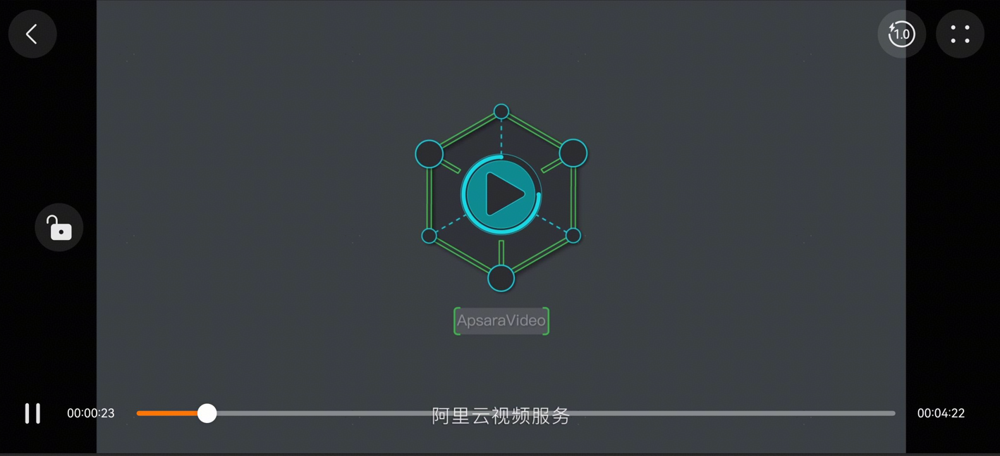

# 阿里云播放器UniApp组件快速入门

## 目录

- [简介](#简介)
- [约束和限制](#约束和限制)
- [快速入门](#快速入门)
- [API参考](#API参考)
- [示例代码](#示例代码)

## 简介

如果您的UniApp项目中需要使用播放器的功能，可以直接将此组件集成到项目中，本组件提供了播放、暂停、横屏、锁屏等常规功能，满足基本的播放需求，从而可以提高开发效率。

组件包含的主要功能如下：

- 播放、暂停、倍速、音量调节、亮度调节的功能
- 指定位置播放、播放进度回调、状态回调
- 视频加密方式播放
- 横屏播放、锁屏的功能



本组件工程结构如下所示：

```ts
native-ali-player                               // 阿里云播放器组件
  |- utssdk
  |   └- app-harmony                            // 鸿蒙平台自定义内容
  |        |- player                            // 播放器实现的主要代码
  |        |    |- BrightnessAdjustPanel.ets    // 亮度调节
  |        |    |- CommonUtils.ets              // 通用工具
  |        |    |- Constants.ets                // 常量
  |        |    |- ErrorInfo.ets                // 播放错误页面
  |        |    |- FinishScene.ets              // 完成播放页面
  |        |    |- HeaderButton.ets             // 顶部操作按钮
  |        |    |- LoadingScene.ets             // 加载缓冲框
  |        |    |- Modals.ets                   // 自定义接口
  |        |    |- Player.ets                   // 播放器入口
  |        |    |- UIController.ets             // 播放器控制器
  |        |    |- VideoComponent.ets           // 播放器核心组件
  | 	   |    |- VideoController.ets          // 播放器实例管理
  |        |    |- VideoControls.ets            // 底部操作按钮
  |        |    |- VolumeAdjustPanel.ets        // 音量调节
  |        |    └- WinLock.ets                  // 锁屏界面
  |        |-resources                          // 坐标文件
  |        |- config.json                       // 三方依赖配置
  |        |- index.uts                         // 组件封装入口
  |        └- PlayerBuilder.ets                 // UniApp集成组件入口
  └- package.json                               // 模块配置
```

## 约束和限制

### 环境

- DevEco Studio版本：DevEco Studio 5.0.1 Release及以上
- HarmonyOS SDK版本：HarmonyOS 5.0.1 Release SDK及以上
- 设备类型：华为手机（直板机，折叠机）
- 系统版本：HarmonyOS 5.0.1 Release及以上
- Hbuilder X版本：4.75及以上

### 权限

- 网络权限：ohos.permission.INTERNET
- 获取Wifi信息权限：ohos.permission.GET_WIFI_INFO
- 获取网络状态权限：ohos.permission.GET_NETWORK_INFO

### 调试

本组件不支持模拟器调试，请使用真机调试

## 快速入门

1、安装组件

下载组件包，解压放到UniApp项目的uni_modules文件夹下（如果没有右键项目新建）。

2、配置License

阿里云播放器需要License授权才能使用，需要与应用包名绑定，详细请参考[管理License](https://help.aliyun.com/zh/vod/developer-reference/license-authorization-and-management) 。

UniApp项目具体配置信息如下：

- 包名配置：根目录下manifest.json -> app-harmony -> distribute -> bundleName

- License文件：harmony-configs/entry/src/main/resources/rawfile/ohosLicense.crt

- module.json5：harmony-configs/entry/src/main/module.json5

  以下为参考示例：

  ```json
  "metadata": [
    {
      "name": "com.aliyun.alivc_license.licensekey",
      "value": "MoCTfuQ391Z01mNqG8f8786e23c8a457a8ff8d5faedc1040c"
    },
    {
      "name": "com.aliyun.alivc_license.licensefile",
      "value": "ohosLicense.crt"
    }
  ]
  ```

注：如果只是调试也可以使用官方demo中的包名和License信息。

3、签名

调试不要求一定是正式的签名信息，可以使用DevEco Studio自动生成的签名信息复制到harmony-configs/build-profile.json5中。

4、注册组件。

在UniApp项目中找到App.vue文件，引入组件。

```javascript
import '@/uni_modules/native-ali-player'
```

5、在需要使用播放器的地方引入组件。

```HTML
<embed tag="native-ali-player"></embed>
```


## API参考

### 组件

```html
<embed
  tag="native-ali-player"
  :options="options"
  @onfullscreen="onFullScreen"
  @onprogress="onProgress"
  @onstate="onState"
></embed>
```

**参数**

| 参数名        | 类型                        | 是否必填 | 说明                                    |
| ------------- | --------------------------- | -------- | --------------------------------------- |
| tag           | string                      | 是       | 组件的注册名（固定是native-ali-player） |
| options       | [options](#options对象说明) | 否       | 自定义参数                              |
| @onfullscreen | Function                    | 否       | 是否全屏的监听器                        |
| @onprogress   | Function                    | 否       | 进度监听器                              |
| @onstate      | Function                    | 否       | 播放状态监听器                          |

### options对象说明

| 参数名       | 类型                                  | 是否必填 | 说明                                                   |
| ------------ | ------------------------------------- | -------- | ------------------------------------------------------ |
| vodType      | string                                | 否       | 默认url，只有url（普通链接播放）和auth（加密播放）选项 |
| videoUrl     | string                                | 否       | 普通播放必填，加密播放不必填                           |
| invokeMethod | [invokeMethod](#invokeMethod对象说明) | 否       | 操作方法                                               |
| authInfo     | [authInfo](#authInfo对象说明)         | 否       | 认证信息，普通播放不必填，加密播放必填                 |

### invokeMethod对象说明

| 参数名    | 类型   | 是否必填 | 说明                                                         |
| --------- | ------ | -------- | ------------------------------------------------------------ |
| method    | string | 否       | 可填写如下选项：<br/>start：播放<br/>pause：暂停<br/>seekTo：到指定时间点开始播放，params={value: "传入毫秒数"}<br/>speed：倍速，params={value:"倍速"} 0.75 1.0 1.25 1.5 2.0<br/>fullscreenChange：全屏 |
| versionId | number | 否       | 自增ID，防止出现重复触发的情况                               |
| params    | object | 否       | 根据method传递的参数判断，详见method参数说明                 |

### authInfo对象说明

| 参数名   | 类型   | 是否必填 | 说明         |
| -------- | ------ | -------- | ------------ |
| videoId  | string | 是       | videoID      |
| playAuth | string | 是       | 加密认证信息 |

## 示例代码

### 示例1：普通链接播放方式

```vue
<template>
	<view class="content">
		<view class="title" v-if="!fullScreenShow">
			<view class="header">普通链接播放</view>
		</view>
		<embed
			class="native-ali-player"
			:class="fullScreenShow ? 'full-screen' : ''"
			tag="native-ali-player"
			:options="options"
			@onfullscreen="onFullScreen"
			@onprogress="onProgress"
			@onstate="onState"
			@onbackbutton="onBackButton"
		></embed>
		<view v-if="!fullScreenShow" class="btns">
			<view class="wrapper">
				<view class="item">进度毫秒: {{progressValue}}</view>
				<view class="item">状态：{{ getStateName() }}</view>
				<button v-if="buttonIsShow()" class="item" @tap="start">开始</button>
				<button v-if="buttonIsShow()" class="item" @tap="pause">暂停</button>
				<button v-if="buttonIsShow()" class="item" @tap="seek">跳到中间</button>
				<button v-if="buttonIsShow()" class="item" @tap="speed">倍速</button>
			</view>
		</view>
	</view>
</template>

<script>
	let versionId = 0;
	export default {
		onBackPress() {
			if (this.fullScreenShow) {
				this.fullscreen()
				return true;
			} else {
				return false;
			}
		},
		onHide() {
			this.lastState = this.state
			if (this.lastState === 3) {
				this.pause()
			}
		},
		onShow() {
			if (this.lastState === 3) {
				this.start()
			}
		},
		data() {
			return {
				title: 'Hello',
				options: {
					videoUrl: 'https://www-file.huawei.com/admin/asset/v1/pro/view/a20e0965e56a4dc498fc33ee23750c0d.mp4',
					invokeMethod: {
						method: ''
					}
				},
				fullScreenShow: false,
				progressValue: 0,
				state: -100,
				lastState: -100
			}
		},
		onLoad() {

		},
		methods: {
			buttonIsShow() {
				return [2, 3, 4].indexOf(this.state) !== -1
			},
			getStateName() {
				let toastStatus = ''
				 switch (this.state) {
				   case -1: toastStatus = "未知"; break;
				   case 0: toastStatus = "空状态"; break;
				   case 1: toastStatus = "初始化"; break;
				   case 2: toastStatus = "准备成功"; break;
				   case 3: toastStatus = "正在播放"; break;
				   case 4: toastStatus = "已暂停"; break;
				   case 5: toastStatus = "已停止"; break;
				   case 6: toastStatus = "播放完成"; break;
				   case 7: toastStatus = "播放出错"; break;
				   default: toastStatus = "未知"; break;
				 }
				 return toastStatus;
			},
			onFullScreen(e) {
				this.fullScreenShow = !this.fullScreenShow
			},
			onProgress(e) {
				console.log(JSON.stringify(e))
				this.progressValue = e.detail.value
			},
			onState(e) {
				this.state = e.detail.value
			},
			onBackButton() {
				uni.showToast({
					title: '点击了视频的返回按钮'
				})
			},
			start() {
				let _options = {...this.options}
				_options.invokeMethod = {
					method: 'start',
					versionId: ++versionId
				}
				this.options = _options
			},
			pause() {
				let _options = {...this.options}
				_options.invokeMethod = {
					method: 'pause',
					versionId: ++versionId
				}
				this.options = _options
			},
			seek() {
				let _options = {...this.options}
				_options.invokeMethod = {
					method: 'seekTo',
					versionId: ++versionId,
					params: {
						value: "131000"
					}
				}
				this.options = _options
			},
			speed() {
				let _options = {...this.options}
				_options.invokeMethod = {
					method: 'speed',
					versionId: ++versionId,
					params: {
						value: "2.0"
					}
				}
				this.options = _options
			},
			fullscreen() {
				let _options = {...this.options}
				_options.invokeMethod = {
					method: 'fullscreenChange',
					versionId: ++versionId
				}
				this.options = _options
			}
		}
	}
</script>

<style>
	.content {
		display: flex;
		flex-direction: column;
		align-items: center;
		justify-content: center;
	}
	.title {
		margin: 150rpx 0 80rpx 0;
		font-size: 40rpx;
	}
	.native-ali-player {
		width: 300px;
		height: 200px;
	}
	.full-screen {
		position: fixed;
		top: 0;
		right: 0;
		bottom: 0;
		left: 0;
		width: 100% !important;
		height: 100% !important;
	}
	.btns {
		width: 300px;
	}
	.btns>.wrapper {
		margin: 20px 50px;
	}
	.btns>.wrapper>.item {
		margin: 15px 0;
	}
</style>
```

### 示例2：加密链接播放方式

```vue
<template>
	<view class="content">
		<view class="title" v-if="!fullScreenShow">
			<view class="header">认证链接播放</view>
		</view>
		<embed v-if="isShow"
			class="native-ali-player"
			:class="fullScreenShow ? 'full-screen' : ''"
			tag="native-ali-player"
			:options="options"
			@onfullscreen="onFullScreen"
			@onstate="onState"
		></embed>
	</view>	  
</template>

<script>
	let versionId = 1000000;
	export default {
		onBackPress() {
			if (this.fullScreenShow) {
				this.fullscreen()
				return true;
			} else {
				return false;
			}
		},
		onHide() {
			this.lastState = this.state
			if (this.lastState === 3) {
				this.pause()
			}
		},
		onShow() {
			if (this.lastState === 3) {
				this.start()
			}
		},
		data() {
			return {
				isShow: false,
				options: {
					vodType: 'auth',
					authInfo: {}
				},
				fullScreenShow: false,
				state: -100,
				lastState: -100
			}
		},
		onLoad(params) {
			const _options = {
				vodType: 'auth',
				authInfo: {
					videoId: params.videoId,
					playAuth: params.playAuth
				}
			}
			this.options = _options
			this.isShow = true;
		},
		methods: {
			onFullScreen(e) {
				this.fullScreenShow = !this.fullScreenShow
			},
			fullscreen() {
				let _options = {...this.options}
				_options.invokeMethod = {
					method: 'fullscreenChange',
					versionId: ++versionId
				}
				this.options = _options
			},
			onState(e) {
				this.state = e.detail.value
			},
			start() {
				let _options = {...this.options}
				_options.invokeMethod = {
					method: 'start',
					versionId: ++versionId
				}
				this.options = _options
			},
			pause() {
				let _options = {...this.options}
				_options.invokeMethod = {
					method: 'pause',
					versionId: ++versionId
				}
				this.options = _options
			}
		}
	}
</script>

<style>
	.content {
		display: flex;
		flex-direction: column;
		align-items: center;
		justify-content: center;
	}
	.title {
		margin: 150rpx 0 80rpx 0;
		font-size: 40rpx;
	}
	.native-ali-player {
		width: 300px;
		height: 200px;
	}
	.full-screen {
		position: fixed;
		top: 0;
		right: 0;
		bottom: 0;
		left: 0;
		width: 100% !important;
		height: 100% !important;
	}
</style>
```
