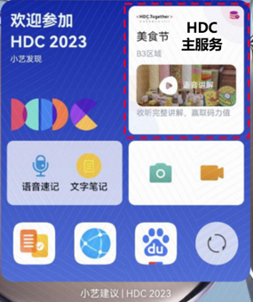

# 2023 HDC元服务 Demo

## 介绍

2023HDC元服务是HDC大会的元服务样例。  

此元服务实现大会签到、参加分论坛、码力互动、集成华为帐号能力关键场景，以及在元服务里查看大会期间班车信息、餐饮地址及快捷打车等。

场景一：大会签到  
开发者到达东莞篮球中心及三丫坡时，负一屏及小艺建议会推荐签到门票码，助力开发者快速入场。  

场景二：参加分论坛  
1.元服务里查看、预约议程。  
2.负一屏及小艺建议显示已预约或最近的议程信息，提醒开发者准时参会。  
3.卡片加桌：随时随地查看最新议程信息。  

场景三：码力互动  
在指定范围内负一屏及小艺建议推出活动内容，开发者点击卡片参与即可获得码力值。    
  

## 技术支持

如果您对使用2023 HDC元服务示例代码有疑问，请尝试到[华为开发者论坛](https://developer.huawei.com/consumer/cn/forum/block/application) HarmonyOS应用/服务开发板块与其他开发者进行交流。

如果您在尝试示例代码中遇到问题，请向仓库提交[issue](https://github.com/AppGalleryConnect/agc-HarmonyOS-demos/issues)。

## 授权许可

该示例代码经过[Apache 2.0 授权许可](http://www.apache.org/licenses/LICENSE-2.0)。
