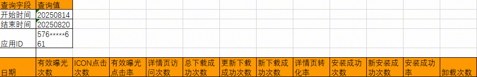

# 基于Reports API获取目标报表数据

## 简介

本示例展示了如何通过代码调用Reports API获取目标报表数据。

## 效果预览




## 配置与使用

1. 下载代码，将示例中clientId、clientSecret和appId的值替换成应用实际的数值，获取方式可参见[查看应用信息](https://developer.huawei.com/consumer/cn/doc/app/agc-help-view-app-info-0000002282674569)。 
2. 运行代码工程。


## 工程目录

```
├──ReportApiDemo/src/main/java/com/demo       // 代码区                           
│  └──ReportApiDemo.java                      // 示例代码文件
```


## 相关权限

不涉及。

## 约束与限制

服务器必须支持Java 8或更高版本。 