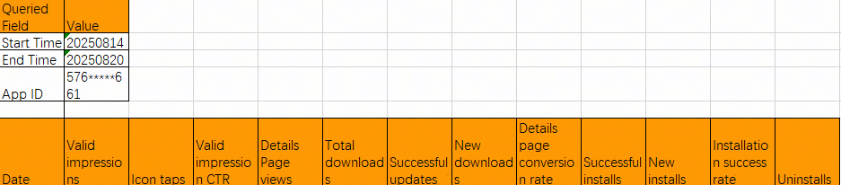

# Obtain Target Report Data Based on the Reports API

## Overview

This sample code shows how to use code to call the Reports API to obtain target report data.

## Preview




## Configuration and Usage

1. Download the demo and replace the values of clientId, clientSecret, and appId with the actual values of the application. For details on how to obtain it, please refer to [here](https://developer.huawei.com/consumer/en/doc/app/agc-help-view-app-info-0000002282674569).
2. Run the demo project.


## Project Directory

```
├──ReportApiDemo/src/main/java/com/demo      // Code area
│  └──ReportApiDemo.java                     // Demo file
```


## Required Permissions

N/A

## Restrictions

The server must support Java 8 or later.