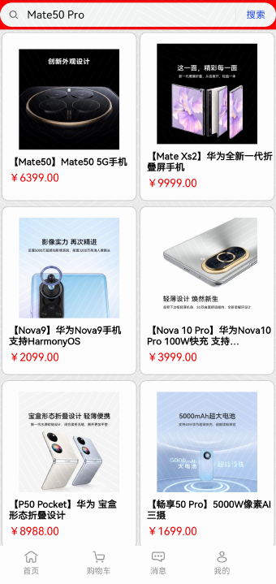
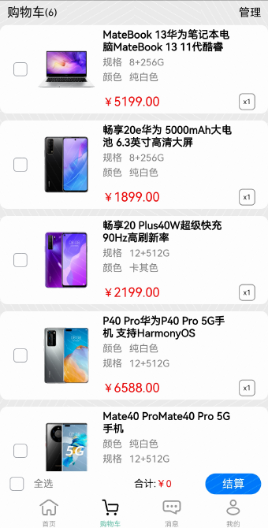
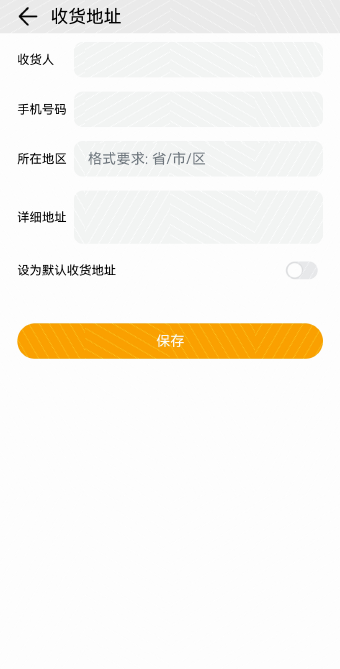
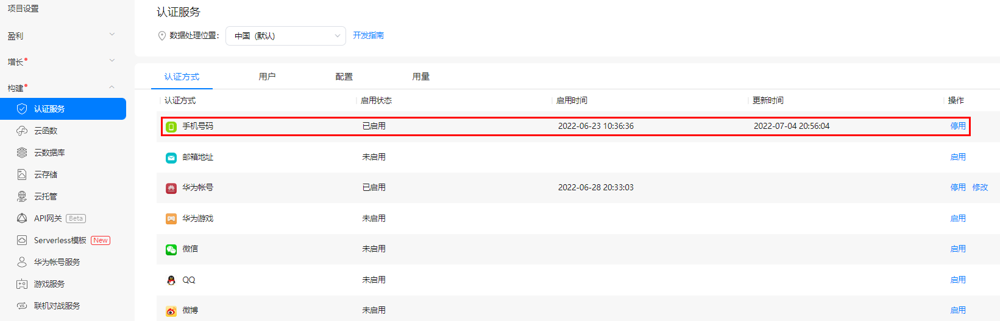

# Mini商城

### 简介

这是一个Mini商城模板，前台使用ArkUI构建，后台使用AppGallery Connect的Serverless服务构建（包含云函数、云数据库、认证服务和云存储）。效果图如下：

 

### 相关权限
不涉及。

### 使用方式
1. 选中“CloudProgram/clouddb”目录，右键“Deploy Cloud Database”部署云数据库
2. 选中“CloudProgram/cloudfunctions”目录，右键”Deploy Cloud Functions“部署云数据库
3. 在[AppGallery Connect控制台](https:://developer.huawei.com/consumer/cn/service/josp/agc/index.html)的”构建-认证服务“下启用手机号认证。
   
4. 运行端侧工程，在应用中查看功能是否正常，功能说明见下

### 功能说明
1. 启动应用显示首页内容，包括“首页”、“购物车”、“消息”、“我的”四个模块，可点击下方tabBar可切换模块内容。
2. “首页”页面具有Grid网格布局，Tabs组件切换等功能，图片及数据资源由云函数调用云数据库提供。
3. “首页”页面的搜索框点击时可直接输入搜索关键词，在云数据库搜索匹配的商品。
4. “购物车”提供了商品的批量结算、删除、新增等操作。
5. “我的”页面使用认证服务构建了手机号登录的能力，并提供了收货地址的增改查功能。
6. “消息”页面为低码方式构建的静态页面。

### 注意事项
1. 新增地址时，所在地区应填写为"省/市/区"格式，否则将导致地址无法保存。
2. “我的”页面下的“支付设置”和“账号与安全”功能暂未实现，敬请期待。
3. 我的订单中的“待付款”、“待发货”、“待评价”订单类型暂未实现，敬请期待。

### 约束与限制
1.本示例仅支持在HarmonyOS API9系统上运行。